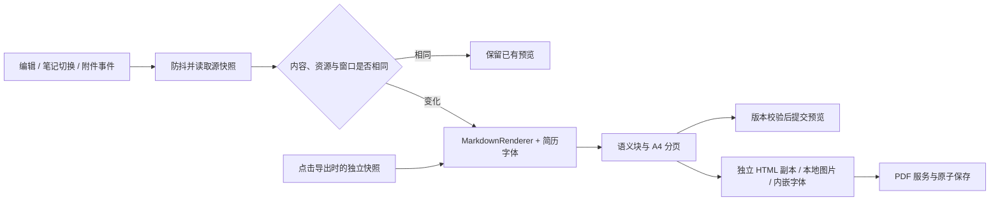

# 架构与性能复核

更新：2026-10-05。对应 0.1.2 的架构重构；历史 0.1.1 发布文件保持不变。当前发布进度见[发布记录](RELEASING.md)。本轮保持 HTML 预览、完整思源黑体、现有模板及 PDF 排版规则。

## 模块职责

| 模块 | 职责与边界 |
| --- | --- |
| `main.ts` | 接入 Obsidian 命令、编辑器和 Vault 事件；选择源笔记、取得快照，协调模板与视图。 |
| `resume-location.ts` | 统一新建位置：显式右键目标、最近操作的文件夹选择、当前笔记目录、Vault 根目录。Notebook Navigator 使用可选公共 API；核心文件列表的私有选择状态仅在此适配，失效时回退笔记目录。切换笔记清除旧导航上下文。2026-10-08 开发版新增。 |
| `view.ts` | 管理预览防抖、版本校验、内容去重、缩放与导出状态。编辑读取延迟执行，但保留触发编辑器身份并检查其文件绑定。 |
| `model.ts` | 保留原文行号的轻量字段适配、明确框架修复、数据类型及版本门控；不加载宿主、文件系统或字体。 |
| `async.ts` | 统一超时、取消与等待清理。取消等待不会自动终止底层操作，资源所属模块负责释放。 |
| `render.ts` | 使用 Obsidian MarkdownRenderer，整理语义块、等待所需资源、分页，生成独立导出副本；返回本地附件依赖集合。 |
| `fonts.ts` / `bundled-font.ts` | 延迟解码原始字体、按 Document 注册字体、缓存导出 CSS，关闭窗口或卸载时释放注册。 |
| `pdf.ts` | 集中非公共桌面桥接、保存对话框、打印窗口与原子文件写入；其他模块不直接创建 Electron 窗口。 |

## 处理的问题

- **重复计算**：编辑、自动保存、工作区事件可能重复指向相同内容。现在比较源路径、文本、资源修订及所属文档；相同内容无需重新解析、布局和替换 DOM。时间戳不参与内容比较。
- **频繁读取编辑器**：事件记录编辑来源，70 ms 防抖后才读取文本。导出仍固定点击时的快照，不复用可能变化的预览 DOM。
- **附件失效**：追踪普通正文图片及头像；相关附件创建、修改、重命名、删除可重新渲染。待处理、渲染中、错误或未解析资源状态采用保守失效，元数据解析完成后允许恢复。空闲成功状态忽略无关附件变化。
- **重复扫描与复制**：空字段的后文查找改为一次索引；超长段落二分分页仅生成试探所需的前部，不反复复制完整原段落及尾部。
- **字体和图片开销**：仅等待简历所需字体，不等待其他主题的字体；导出复用已有字体 Base64，重复图片在单次导出中只读取和编码一次。
- **资源生命周期**：图片加载失败会清理其他等待项，取消导出会停止图片读取并关闭打印窗口；关闭弹出窗口释放对应字体注册。预览窗口迁移会重新注册字体，防抖计时器由创建它的窗口清理。
- **模块耦合**：异步取消从 Markdown 模型拆出，PDF 桥接可替换以验证失败、取消和重试；没有引入框架、全局状态库或新的运行时依赖。
- **工具链冗余**：默认构建与发布构建一致；调试映射仅用于显式开发模式。移除重复类型检查，监听模式同步独立 CSS/manifest，测试前清理陈旧产物。

## 验证方式与证据

静态验证：`npm run check:release`，包括 ESLint、30 项自动测试、TypeScript、三文件打包、字体字节及许可检查。新增测试覆盖取消/超时、字体缓存与窗口释放、PDF 取消/失败/重试。

宿主验证使用带 `.mcv-release-qa` 标记的隔离 Vault；不向日常笔记库安装测试构建。既有 `tmp/release-qa.json` 保存目标；`npm run test:architecture` 验证重复更新、延迟读取、过期结果、图片失效恢复、跨窗口及 PDF 快照。`--before` 模式只用于仍安装旧版的测试库。

本轮旧版与重构版使用同一台 Mac、同一 Obsidian 1.13.7 和虚构样例：

| 场景 | 旧版 | 重构版 |
| --- | --- | --- |
| 完成首次预览后，顺序发送 10 次相同内容 | 10 次额外完整渲染 | 0 次额外完整渲染 |
| 防抖窗口内发送 50 次不同内容 | 1 次渲染 | 1 次渲染，最终内容正确 |
| 防抖窗口内发送 50 次延迟读取请求 | 未提供此接口 | 读取编辑器 1 次 |
| 标准简历 / 多页简历 / 超长段落 | 1 / 2 / 2 页 | 同页数，渲染文本逐字一致 |

本轮结果证明减少了重复工作，不能据此宣称所有输入或 PDF 导出的耗时按固定比例下降。单次 PDF 导出和长段落计时受宿主负载影响，不作为性能承诺。

架构复核使用发布安装流程回归，覆盖仅安装三个文件、断网预览与导出、字体只解码一次、照片、150% 缩放、卸载/重载。生成标准、两页和照片三份 PDF；Poppler 与 macOS PDFKit 检查逐页文字、搜索选择、链接、字体嵌入、A4 尺寸和照片，另检查页面渲染效果。该轮测试构建仍使用 0.1.1 版本元数据；递增后的 0.1.2 安装包核对单独记录于[发布验收](RELEASE-0.1.2.md)。

原始本地证据位于 `evidence/architecture-20261005/`（不入库）：`before.json`、`after.json`、`comparison.json`、`release-host/host-results.json`、`release-host/pdf-results.json`。重跑发布宿主回归可传独立配置，避免覆盖历史证据：`node scripts/release-host-tests.mjs tmp/architecture-qa.json`。

## 保留的约束

- 实际内容变化时仍执行完整 Markdown 渲染与分页。对于普通简历，这比引入复杂的段落缓存更易保证版式和内容正确；长文档增量分页需要单独设计。
- 完整思源黑体仍内嵌于 `main.js`，超过 Sync Standard 的单文件 5 MB 限制。本轮减少重复编码与等待，不缩减字库覆盖范围，也未解决这一发布体积警告。
- PDF 仍依赖宿主非公共 `@electron/remote` 桥接；本轮改善生命周期，不改变该兼容风险。当前仅 macOS 宿主验证，Windows/Linux、移动端及长时间使用测试不在本轮通过范围。
- 本地 ESLint 对打印 DOM 的 `createElement` 保留说明性例外。0.1.2 补充英文安装与使用说明；不能据此认为社区所有审核警告均已解决。社区重新构建、来源证明及审核结果见发布记录。
